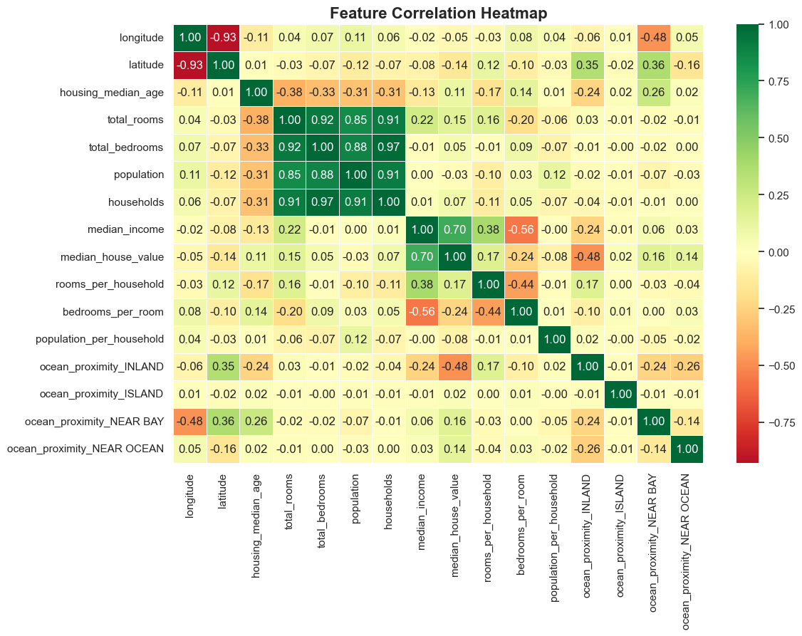
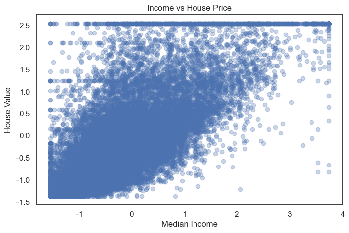
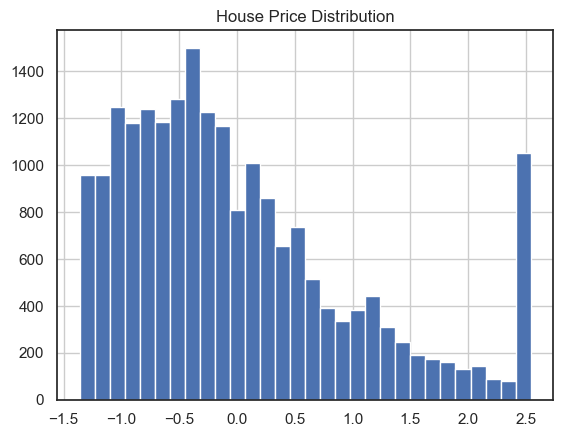
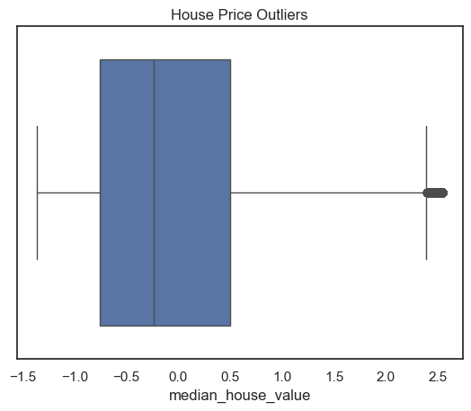

<h1 align="center" style="font-size: 50px;">
🏡 Housing Intelligence Pipeline
</h1>

California Price Analysis & Feature Engineering

---

## 📌 Project Overview
This project explores the California Housing dataset to understand what affects house prices.  
It focuses on **data cleaning, feature engineering, and exploratory data analysis (EDA)** to uncover useful insights.

---

## Problem Statement
Housing prices depend on factors such as income, location, and housing conditions.  
This project looks at:

- What drives house prices?  
- How does location affect pricing?  
- What patterns exist in the data?  

> I expected income and location to play a big role, and used data analysis to confirm this.

---

## 🛠️ Tools & Technologies
- Python  
- Pandas  
- Scikit-learn  
- Matplotlib  
- Seaborn  
- Jupyter Notebook  

---

## My Role & Contributions
- Cleaned and prepared the dataset  
- Handled missing values and removed duplicates  
- Created new features to improve analysis  
- Explored the data to find patterns and relationships  
- Built visualizations to explain insights  

---

## 🔧 Data Transformation & Feature Engineering
- Created new features:
  - Rooms per household  
  - Bedrooms per room  
  - Population per household  
- Converted categorical data using one-hot encoding  
- Scaled numerical features using StandardScaler  

---

## 📊 Exploratory Data Analysis (EDA)

### 🔥 Correlation Heatmap
  
*Shows relationships between variables.*

---

### 📈 Income vs House Price
  
*Higher income areas tend to have higher house prices.*

---

### 📦 Price Distribution
  
*Most house prices are concentrated in lower to mid ranges.*

---

### 📦 Outliers (Boxplot)
  
*Some high-value houses exist outside the normal range.*

---

## 🔍 Key Insights

- Income is the strongest factor affecting house prices  
- Houses near the coast are more expensive  
- There is a price limit in the dataset (ceiling effect)  
- Some high-value houses stand out as outliers  
- House prices depend on income, location, and housing features  

---

## 💼 Business Implications

- High-income areas may offer better investment opportunities  
- Location (especially coastal areas) greatly affects pricing  
- Pricing models should consider both income and location  

---

## Deliverables

- **Engineered Dataset**  
  - `engineered_housing.csv` (ready for modeling)

- **Code**  
  - Data transformation and feature engineering pipeline  
  - Includes encoding, scaling, and feature creation  

---

## Final Outcome

The dataset has been:
- Cleaned and structured  
- Converted into numerical format  
- Enhanced with new features  

The data is now ready for machine learning models.

---

## ❓ Interview Questions

### Scaling vs Normalization
- Scaling standardizes data (mean = 0, std = 1)  
- Normalization rescales data between 0 and 1  

### Why use One-Hot Encoding
- Converts categorical data into numeric format  
- Prevents incorrect ranking of categories  

---

## Conclusion
This project shows how cleaning and exploring data helps us understand what affects house prices.  
It highlights income and location as key factors and prepares the data for future modeling.

---

## 🚀 Future Improvements
- Build a machine learning model to predict house prices   
- Improve feature selection and tuning  
---

##  Author
**Marianne Ongondi**  
